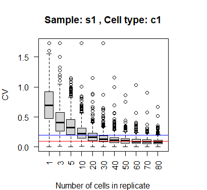

<!-- README.md is generated from README.Rmd. Please edit that file -->

# VICE

<!-- badges: start -->
<!-- badges: end -->

VICE calculates gene-level variability in single-cell or single-nuclei RNA-seq data by constructing pseudo-replicates. Additionally, it can estimate the true positive rate of single-cell differential gene expression analysis for genes with varying signal-to-noise levels.


## Installation

You can install the development version of VICE from
[GitHub](https://github.com/) with:

``` r
# # install.packages("devtools")
devtools::install_github("RujiaDai/VICE")
```

## Example

Application #1: calculate expression variability for specific cell type in specific sample
``` r
library(VICE)
data(cmat)
# cmat[1:6,1:6]
#       Cell1 Cell2 Cell3 Cell4 Cell5 Cell6
# Gene1    73     4     2    20    50     4
# Gene2    29    17    36     7     0    19
# Gene3    97   424   304   534   198   229
# Gene4     1     4     3    16    11     3
# Gene5   462   128   104    44    68    12
# Gene6    31   150   381   561    67  1323

data(cmeta)
# head(cmeta)
#       sample celltype
# Cell1     s1       c1
# Cell2     s1       c1
# Cell3     s1       c1
# Cell4     s1       c1
# Cell5     s1       c1
# Cell6     s1       c1

cvlist <- get_cv_for_replicates(cmeta, cmat, 3)
cvplot(cvlist, "s1", "c1")
```


The parameter of VICE includes: the count matrix from sc/snRNAseq study `cmat` (gene by cell), the metadata of cells `cmeta` (cell by feature, "sample" and "celltype" must be provided), number of pseudo-replicates `k`. Function `cvplot` can visualize the CV value in specific sample `s1` for specific cell type `c1`.


The application of VICE on multiple sc/snRNAseq data can be found in <https://www.biorxiv.org/content/10.1101/2024.04.12.589216v1>.
