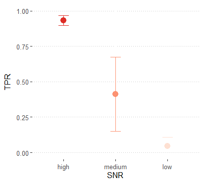

<!-- README.md is generated from README.Rmd. Please edit that file -->

# VICE

<!-- badges: start -->
<!-- badges: end -->

VICE calculates gene-level variability in single-cell or single-nuclei RNA-seq data by constructing pseudo-replicates. Additionally, it can estimate the true positive rate of single-cell differential gene expression (DE) analysis for genes with varying signal-to-noise levels.


## Installation

You can install the development version of VICE from
[GitHub](https://github.com/) with:

``` r
# # install.packages("devtools")
devtools::install_github("RujiaDai/VICE")
```

## Example #1: calculate expression variability for specific cell type in specific sample
``` r
library(VICE)
data(cmat)
# cmat[1:6,1:6]
#       Cell1 Cell2 Cell3 Cell4 Cell5 Cell6
# Gene1    73     4     2    20    50     4
# Gene2    29    17    36     7     0    19
# Gene3    97   424   304   534   198   229
# Gene4     1     4     3    16    11     3
# Gene5   462   128   104    44    68    12
# Gene6    31   150   381   561    67  1323

data(cmeta)
# head(cmeta)
#       sample celltype
# Cell1     s1       c1
# Cell2     s1       c1
# Cell3     s1       c1
# Cell4     s1       c1
# Cell5     s1       c1
# Cell6     s1       c1

cvlist <- get_cv_for_replicates(cmeta, cmat, 3)
cvplot(cvlist, "s1", "c1")
```


The parameter includes: the count matrix from sc/snRNAseq study `cmat` (gene by cell), the metadata of cells `cmeta` (cell by feature, "sample" and "celltype" must be provided), number of pseudo-replicates `k`. Function `cvplot` can visualize the CV value in specific sample `s1` for specific cell type `c1`.

## Example #2: estimate true positive rate for single-cell DE analysis
``` r
library(VICE)

tpr_all<-get_tpr_all(ngene=2000,ncell=500,nsample=3,de.prob=0.3,de.facloc=0.1,de.facScale=0.1,nperm=10)

tpr_all
# [1] 0.7030303 0.7979275 0.7350000 0.6964286 0.6973684 0.7784091 0.7606383 0.7187500 0.7041420
# [10] 0.7615894

tpr<-get_tpr(ngene=2000,ncell=500,nsample=3,de.prob=0.3,de.facloc=0.1,de.facScale=0.1,nperm=10)

tpr
# high    medium        low
# 1  0.8585859 0.0000000 0.00000000
# 2  0.9424460 0.4285714 0.03703704
# 3  0.9574468 0.7222222 0.07272727
# 4  0.9453125 0.6153846 0.03030303
# 5  0.9305556 0.0000000 0.00000000
# 6  0.9534884 0.5128205 0.14285714
# 7  0.9774436 0.5000000 0.02222222
# 8  0.9105691 0.2000000 0.00000000
# 9  0.9636364 0.6923077 0.16279070
# 10 0.8976378 0.4500000 0.00000000
```
R package [`splatter`](https://oshlacklab.com/splatter/reference/SplatParams.html) was used for data simulation.
The parameter includes: number of genes `ngene`, number of cells per sample `ncell`, number of samples in each DE group `nsample`, probability that a gene is differentially expressed in a group`de.prob`, Location (meanlog) parameter for the differential expression factor log-normal distribution `de.facloc`, Scale (sdlog) parameter for the differential expression factor log-normal distribution `de.facScale`, iteration times `nperm`. 




The application of VICE on multiple sc/snRNAseq data can be found in <https://www.biorxiv.org/content/10.1101/2024.04.12.589216v1>.
